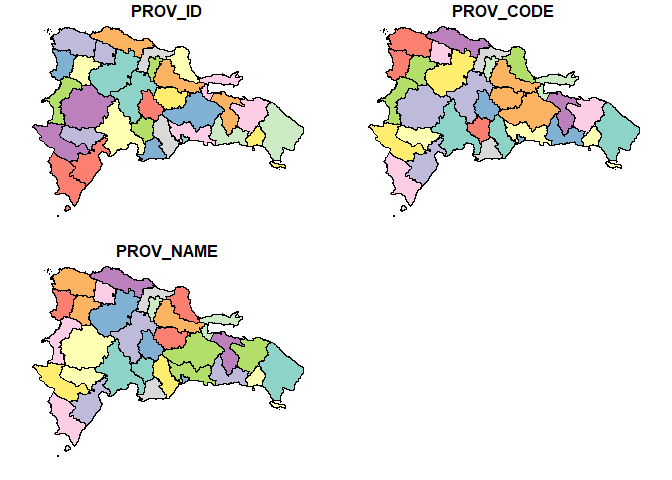
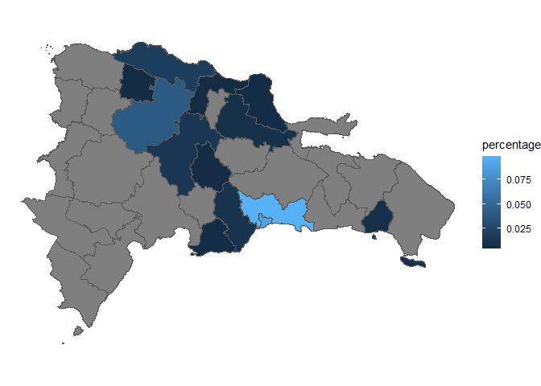

<!-- README.md is generated from README.Rmd. Please edit that file -->

# rgisDR <a href="https://adatar-do.github.io/rgisDR/"></a>

<!-- badges: start -->

[](https://www.repostatus.org/#wip)
[](https://www.tidyverse.org/lifecycle/#experimental)

<!-- badges: end -->

The goal of rgisDR is to provide GIS tools for the Dominican Republic.
It includes simple features for administrative divisions and tools for
cleaning and standardizing administrative names.

## Installation

You can install the development version of rgisDR from r-universe with:

``` r
install.packages('rgisDR', repos = c('https://adatar-do.r-universe.dev', 'https://cloud.r-project.org'))
```

## Example

This is a basic example which shows you how to use rgisDR:

``` r
library(rgisDR)
library(dplyr)
#> 
#> Attaching package: 'dplyr'
#> The following objects are masked from 'package:stats':
#> 
#>     filter, lag
#> The following objects are masked from 'package:base':
#> 
#>     intersect, setdiff, setequal, union
library(sf)
#> Warning: package 'sf' was built under R version 4.3.3
#> Linking to GEOS 3.11.2, GDAL 3.8.2, PROJ 9.3.1; sf_use_s2() is TRUE
library(ggplot2)
#> Warning: package 'ggplot2' was built under R version 4.3.1
```

### Loading simple features

``` r
# Load provinces as sf object
DR_PROV_SF <- dr_provinces()

# Plot provinces
plot(DR_PROV_SF)
```



### Combining metadata and simple features

Suppose you have a dataset showing the percentage distribution of
remittances received in each province of the Dominican Republic for a
specific year. To visualize this data using a graph with rgisDR, you
first need to combine the metadata with the simple features.

``` r
# Example remittance data
remittance_by_province <- sfDR::remittance_by_province %>% 
  mutate(province = if_else(province == "Distrito Nacional", "Dist. Nacional", province))

remittance_by_province
#> # A tibble: 15 × 2
#>    province       percentage
#>    <chr>               <dbl>
#>  1 Dist. Nacional    0.0903 
#>  2 Santiago          0.0399 
#>  3 Santo Domingo     0.0987 
#>  4 Duarte            0.00888
#>  5 La Vega           0.0141 
#>  6 Peravia           0.00595
#>  7 San Cristóbal     0.0107 
#>  8 Puerto Plata      0.0190 
#>  9 Espaillat         0.00449
#> 10 San Pedro         0.00391
#> 11 Monseñor Nouel    0.00579
#> 12 La Romana         0.00844
#> 13 Valverde          0.00442
#> 14 Maria Trinidad    0.00636
#> 15 Otros             0.679
```

Note the name of “Distrito Nacional” in the remittance data does not
match the name in the province simple feature. So, this province will
not be matched when combining the data.

``` r
# Combine remittance data with province data and plot
DR_PROV_SF %>%
  left_join(remittance_by_province, by = join_by(PROV_NAME == province)) %>%
  ggplot() +
  geom_sf(aes(fill = percentage)) +
  theme_void()
```


### Cleaning and standardizing names

We can use the `dr_clean_prov_name` function to clean and standardize
province names. This way, we can ensure that the names in the remittance
data match the names in the province simple feature.

``` r
# Clean province names
remittance_by_province <- remittance_by_province %>% 
  mutate(province = dr_clean_prov_name(province))
#> ✖ The following corrections are questionable at 0.25 of tolerance:
#> ✖ Dist. Nacional ----> Distrito Nacional (.tol >= 0.31)
#> ✖ Otros ------------> La Vega (.tol >= 1.25)
#> ✖ San Pedro --------> San Juan (.tol >= 0.62)
#> ✖ Maria Trinidad ---> María Trinidad Sánchez (.tol >= 0.57)
#> ℹ Please, used one of this options:
#> • Fix these cases manually and try again.
#> • Increase the .tol to accept these corrections.
#> • Use the .on_error argument to control the result.
#> Error in `mutate()`:
#> ℹ In argument: `province = dr_clean_prov_name(province)`.
#> Caused by error in `.check_replacement()`:
#> ! no se puede cambiar el valor de un vínculo bloqueado para  '.error'
```

As you can see, the function throws an error because the tolerance level
is too strict. We can adjust the tolerance level to allow for more
flexibility in matching names. In this case we will use `.tol = 0.6` to
allow the Distrito Nacional and María Trinidad Sánchez names to be
matched. But there are other error matching. Then you can:

- Manually adjust the names in the dataset.
- Use the `.on_error` parameter to handle errors. For example, you can
  use `.on_error = "NA"` to ignore unmatched names.

``` r
# Clean province names
remittance_by_province <- remittance_by_province %>% 
  mutate(province = dr_clean_prov_name(province, .tol = 0.6, .on_error = "NA"))

remittance_by_province
#> # A tibble: 15 × 2
#>    province               percentage
#>    <chr>                       <dbl>
#>  1 Distrito Nacional         0.0903 
#>  2 Santiago                  0.0399 
#>  3 Santo Domingo             0.0987 
#>  4 Duarte                    0.00888
#>  5 La Vega                   0.0141 
#>  6 Peravia                   0.00595
#>  7 San Cristóbal             0.0107 
#>  8 Puerto Plata              0.0190 
#>  9 Espaillat                 0.00449
#> 10 _NA_                      0.00391
#> 11 Monseñor Nouel            0.00579
#> 12 La Romana                 0.00844
#> 13 Valverde                  0.00442
#> 14 María Trinidad Sánchez    0.00636
#> 15 _NA_                      0.679
```

``` r
# Combine remittance data with province data and plot
DR_PROV_SF %>%
  left_join(remittance_by_province, by = join_by(PROV_NAME == province)) %>%
  ggplot() +
  geom_sf(aes(fill = percentage)) +
  theme_void()
```



Now the provinces Distrito Nacional and María Trinidad Sánchez are
matched correctly.
